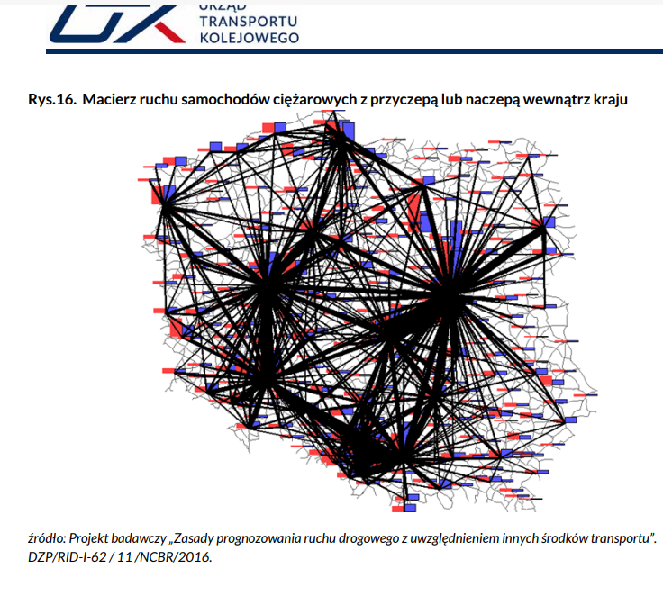

# Tytuł

Pierwsze koty za płoty.

## Kot

Kot kodu nie równy.

## Płot

Płot z kłód to nie najlepszy pomysł.

## I za płotem

At auctor urna nunc id cursus metus aliquam. Eget velit aliquet sagittis id consectetur purus ut. A arcu cursus vitae congue mauris rhoncus aenean.

Non nisi est sit amet. In arcu cursus euismod quis viverra nibh. Eget aliquet nibh praesent tristique magna sit amet purus gravida. Ut consequat semper viverra nam libero justo laoreet sit amet. Malesuada bibendum arcu vitae elementum curabitur vitae nunc sed. Sed adipiscing diam donec adipiscing tristique risus. Eget duis at tellus at urna condimentum mattis. Lobortis scelerisque fermentum dui faucibus in ornare. Ullamcorper sit amet risus nullam eget felis eget nunc lobortis. Iaculis eu non diam phasellus vestibulum. Aliquet sagittis id consectetur purus ut faucibus pulvinar elementum. Netus et malesuada fames ac turpis egestas sed tempus urna. Dignissim convallis aenean et tortor at risus viverra adipiscing at. Vel turpis nunc eget lorem dolor sed viverra.

# Wyróżnianie

Eget _aliquet_ nibh **praesent** tristique magna sit amet purus gravida.

## Cytat

> Aliquet sagittis id consectetur purus ut faucibus pulvinar elementum.

> Aliquet sagittis id consectetur purus ut faucibus pulvinar elementum.

> Aliquet sagittis id consectetur purus ut faucibus pulvinar elementum.

## Równania

Aliquet sagittis id consectetur `x+y=z` purus ut faucibus pulvinar elementum.

## Kod (wyróżnienie)

```
started_in = os.getcwd()
   download_content(terminology_url, terminology_languages)
   os.chdir(started_in)
```

```
x+y=z
```

## Odsyłacze

[Prognoza](https://meteo.pl/)

[https://meteo.pl/]

## Obrazki


