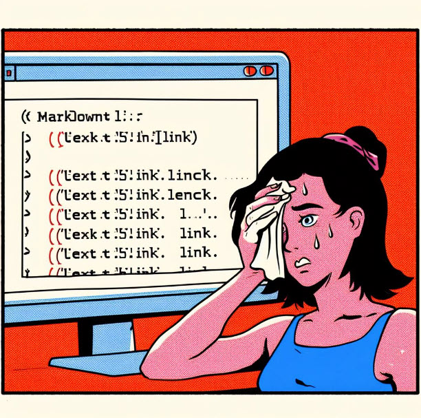

# Markdown

<!--This is Title - Heading H1-->

## Spis treści

- [Markdown](#markdown)
  - [Brief introduction](#brief-intro-in-english)
  - [Characteristis](#characteristic)
  - [Advantages](#advantages)
  - [Formatowanie](#formatowanie)
    - [Pogrubienie](#pogrubienie)
    - [Kursywa](#kursywa-__)
    - [Cytat](#cytat--wyróżnienie)
    - [Wykreślenie](#wykreślanie)
    - [Lista nuerowana](#lista-numerowana-n)
    - [Lista nienumerowana](#lista-nienumerowana)
    - [Równanie](#równanie--2x-shift--enter)
    - [Kod](#kod---wyróżnienie-6x--język-kodu)
    - [Tabele](#tabele------z-wyrównywaniem)
    - [Odsyłacze](#odsyłacze-zewnętrzne-w-komentarzu)
    - [Obrazy](#obrazki-w-komentarzu)
    - [Checklista](#checklista-formatów)

## Brief Intro in English

<!--This is Heading H2-->

<!--This is text paragraph with *italics (alt. _), **bold (alt. __), lower text line by: 2x space + enter, new paragraph by: space + 2x enter-->

**Markdown** is a lightweight markup language.  
Created by John Gruber in 2004.  
Markdown file extension is _.md_ or _markdown_.

With application like MS Word or other you may compile a markdown file. These applications use a Markdown processor or parser which converts a markdown file to printable HTML code.

## Characteristic

<!--This is unordered list-->

Markdown is:

- at present one of the world’s most popular markup languages.
- a simple syntax that formats text as headers, lists, boldface, and so on.
- holding numerous advantages.

## Advantages

<!--This is odereded list with external links-->

1. Made for programmers and others alike.
2. Convertible to formats like PDF, HTML, docs etc.
3. May be used for writing complex emails in simple text.
4. It is used to write formatted pages across various platforms like eg. Github, StackOverflow.
5. Markdown Files can be converted to webpages with tools like [Github Pages](https://pages.github.com/), [Blot](blot.io), etc.

## Formatowanie

### Pogrubienie (\*\*)

Eget _aliquet_ nibh **praesent** tristique magna sit amet purus gravida.

---

### Kursywa (\_\_)

Autorem poniższego cytatu jest _Bernice Johnson Reagon_

---

### Cytat -wyróżnienie (>)

> Życiowe wyzwania nie powinny Cię paraliżować.  
> Powinny pomóc Ci odkryć, kim naprawdę jesteś.

---

### Wykreślanie (~~~~)

~~NIe patrz za siebie~~ Patrz przed siebie.

---

### Lista numerowana (n.)

1. Raz
2. Dwa
3. Trzy

---

### Lista nienumerowana (-)

- szklanka
- wazon
- butelka

---

### Równanie (``, 2x shift + enter)

Obciążenie na oś wagonu oblicza się wg wzoru:  
`P=(G+q)/x`  
gdzie:  
Q - ciężar własny wagonu t  
q - ciężar ładunku t  
x - liczba osi wagonu

---

### Kod - wyróżnienie (6x`) + język kodu

Ciąg Fibonacciego

```Python
n = 10

fibo = [0]*(n)
fibo[0] = 0
fibo[1] = 1

for i in range(2,n):
  fibo[i] = fibo[i-1] + fibo[i-2]

print(fibo)
```

---

### Tabele (|, :---:) z wyrównywaniem

Przykładowa tablica granic obciążeń wagonów:
| Prędkość | A | B | C | D |
| :------- | :---: | :---:| :---: | :---: |
| S | 37,0 | 45,0 | 53,0 | 63,0 |
| 120 | 0,00 |

Smaki owoców tropikalnych:
| Owoc| Emoji | Smak
| :---- | :----: | ---:|
| cytryna | :lemon: |kwaśny
| mango | :mango: | słodki
| grejprut | :grapefruit: | gorzki

---

### Odsyłacze zewnętrzne (w komentarzu)

<!--opis linku nawias kwadratowy, link wklejony w nawias okrągły-->

[Machine hallucinations - Refik Anadol Studio](https://refikanadol.com/works/machine-hallucinations-space-metaverse/?fbclid=IwAR1w9llGY0RxjgYAcj_zqkDAK60xdpuVrx7efIkVfL_K1uNTZgU__dD5uFc)

<!--Opcja 2. wleić w nawias okrągły link, bez tekstu alternatywnego, dodać nawias kwadratowy i tekst alternatywny-->

(https://icolorpalette.com/color/pantone-2024-c)

---

### Obrazki (w komentarzu)

<!--opis linku nawias kwadratowy, link wklejony w nawias okrągły-->
<!--Opcja dwa wleić bezpośrednio link, bez tekstu alternatywnego, dodać tekst alternatywny-->



---

### Checklista formatów(-[])

- [ ] Wprowadzenie
- [ ] Spis treści
- [ ] Formatowanie

<!--To jest komentarz-->
