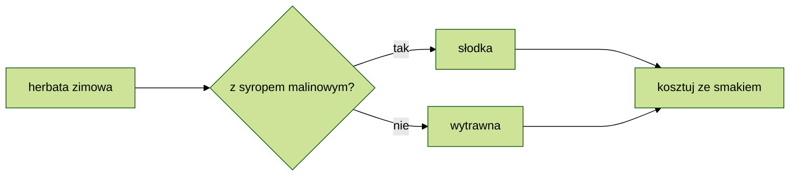

## Formatowanie alternatywne

Spis treści

[Wyliczanie bez listy numerowanej](#wyliczanie-bez-listy-numerowanej)  
[Lista mieszana](#lista-mieszana)  
[Zdjęcie z opisem](#zdjęcie-bez-opisu-i-dymkiem)  
[Link z opisem](#link-z-opisem)  
[Link do YouTube](#link-do-youtube)  
[Checklista](#checklista-formatów)  
[Flowchart](#flowchart)

---

### Wyliczanie bez listy numerowanej

1\. matma  
2\. chemia  
versus lista numerowana

1. matma
2. chemia

Składnia: `wstaw ' \ ' pomiedzy cyfrą a kropką.`

---

### Lista mieszana

1. poniedziałek
2. wtorek
3. środa
   - rano
   - w południe
   - wieczorem

Składnia: `(cyfra., tab, \* )`

---

### Zdjęcie bez opisu i dymkiem

Składnia: `!\[bez tekstu](nazwa pliku "tekst_dymku")`

---

### Link z opisem

[Po godzinach](http://trianglify.io/ "generator wzorów")

Składnia: `\[text]\(url strony "opis linku")`

---

### Link do YouTube

Wstawienie linka do filmu YouTube nie generuje podglądu filmu.  
Alternatywnie można wstawić zdjęcie podglądu i url filmu.

Składnia: `[\!\[text]\(url thumbnail filmu)]\(url YouTube filmu)`

---

### Checklista formatów

- [ ] Wprowadzenie
- [x] Spis treści
- [ ] Formatowanie

Składnia: `(- spacja \[space], spacja, tekst)`

Wprowadzenie pojedynczej spacji pomiędzy nawias kwadratowy tworzy nieinteraktywny checkbox.  
Na GHP tekst wyświetla się za nawiasem kwadratowym bez odstepu.

Alternatywa w formie tabeli (nieinteraktywna):

|  status  |    typ    | zadanie   |
| :------: | :-------: | --------- |
| &check;  | odhaczone | zadanie 1 |
| &#x2611; | odhaczone | zadanie 2 |
|    \_    | bez haka  | zadanie 3 |
| &#x2610; | bez haka  | zadanie 4 |
| &cross;  |  krzyżyk  | zadanie 5 |
| &#x2612; |  krzyżyk  | zadanie 6 |

Składnia: `(- \|tworzy kolumny\|, \----- wyznacza wiersze, \---: wyrównanie w kolumnach,znak encji HTML)`

💡 Encje \&check; i \&cross; w GHD na podglądzie poprawnie generują znaki.

<!--To jest komentarz-->
<!--Przykład opisu encji HTML-->
<!--znak encji HTML, który składa się z znaku ampersanda (&), znaku kratki (#), znaku x, numeru szesnastkowego 2610 i średnika (;)-->

<!--Znalezione w sieci--
|checked|unchecked|crossed|
|---|---|---|
|&check;|_|&cross;|
|&#x2611;|&#x2610;|&#x2612;|--->

---

### Flowchart

💡 Próba wstawienia Mermaid flowchart z zastosowaniem themes - bez powodzenia.  
Dodanie rozszeżenia Markdown Preview Mermaid - nie wystarczyło.  
💡 Czy rozszerzenie z pełnym dostępem zadziałałoby lepiej?
