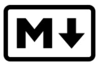

## Formaty alternatywne

### Spis treści

[Wyliczanie bez listy numerowanej](#wyliczanie-bez-listy-numerowanej)  
[Lista mieszana](#lista-mieszana)  
[Zdjęcie z opisem](#zdjęcie-z-opisem)  
[Link z opisem](#link-z-opisem)  
[Link do YouTube](#link-do-youtube)  
[Checklista](#checklista-formatów)  
[Flowchart](#flowchart)

---

### Wyliczanie bez listy numerowanej

5\. matma  
6\. chemia  
versus lista numerowana\
5. matma\
6. chemia

Składnia: _wstaw ' \ ' pomiedzy cyfrą a kropką._

---

### Lista mieszana

1. poniedziałek
2. wtorek
3. środa
   - rano
   - w południe
   - wieczorem

Składnia: _(cyfra., tab, \* )_

---

### Zdjęcie z dymkiem

Składnia: __

---

### Link z opisem

[Po godzinach](http://trianglify.io/) "generator wzorów"

Składnia: _[text](url strony)"opis linku"_

---

### Link do YouTube

Składnia: __

---

### Checklista formatów

- [ ] Wprowadzenie
- [ ] Spis treści
- [ ] Formatowanie

Składnia: _(- [space] Opis)_

<!--To jest komentarz-->

---

### Flowchart

Próba wstawienia Mermaid flowchart z zastosowaniem themes - bez powodzenia.
