## Formaty alternatywne

### Spis treści

[Wyliczanie bez listy numerowanej](#wyliczanie-bez-listy-numerowanej)  
[Lista mieszana](#lista-mieszana)  
[Zdjęcie z opisem](#zdjęcie-bez-opisu-i-dymkiem)  
[Link z opisem](#link-z-opisem)  
[Link do YouTube](#link-do-youtube)  
[Checklista](#checklista-formatów)  
[Flowchart](#flowchart)

---

### Wyliczanie bez listy numerowanej

1\. matma  
2\. chemia  
versus lista numerowana

1. matma
2. chemia

Składnia: _wstaw ' \ ' pomiedzy cyfrą a kropką._

---

### Lista mieszana

1. poniedziałek
2. wtorek
3. środa
   - rano
   - w południe
   - wieczorem

Składnia: _(cyfra., tab, \* )_

---

### Zdjęcie bez opisu i dymkiem

Składnia: _!\[bez tekstu](nazwa pliku "tekst_dymku")_

---

### Link z opisem

[Po godzinach](http://trianglify.io/ "generator wzorów")

Składnia: _\[text]\(url strony "opis linku")_

---

### Link do YouTube

Wstawienie linka do filmu YouTube nie generuje podglądu filmu.  
Możesz Wstawić zdjęcie podglądu i url filmu.

Składnia: _[\!\[text]\(url do thumbnail filmu)]\(link do YouTube filmu)_

---

### Checklista formatów

- [ ] Wprowadzenie
- [ ] Spis treści
- [ ] Formatowanie

Składnia: _(- \[space] text)_

Wprowadzenie pojedynczej spacji pomiędzy nawias kwadratowy tworzy nieinteraktywnego checkboxa.

Alternatywa w formie tabeli (nie interaktywna):

| status   |    typ    | zadanie   |
| -------- | :-------: | --------- |
| &check;  | odhaczone | zadanie 1 |
| &#x2611; | odhaczone | zadanie 2 |
| \_       | bez haka  | zadanie 3 |
| &#x2610; | bez haka  | zadanie 4 |
| &cross;  |  krzyżyk  | zadanie 5 |
| &#x2612; |  krzyżyk  | zadanie 6 |

Składnia: _(- \|tworzy kolumny\|, \----- wyznacza wiersze, \---: wyrównanie w kolumnach,znak encji HTML)_

 💡 \&check; i \&cross; na podglądzie generuje się poprawnie.

<!--To jest komentarz-->
<!--Przykład opisu encji HTML-->
<!--znak encji HTML, który składa się z znaku ampersanda (&), znaku kratki (#), znaku x, numeru szesnastkowego 2610 i średnika (;)-->

<!--Znalezione w sieci--
|checked|unchecked|crossed|
|---|---|---|
|&check;|_|&cross;|
|&#x2611;|&#x2610;|&#x2612;|--->

---

### Flowchart

```mermaid
 %%{init: {'theme': 'forest', "flowchart" : { "curve" : "basis" } } }%%
   flowchart LR
    A[herbata zimowa] ---> B{z syropem malinowym?};
    B --tak--> C[słodka];
    B --nie--> D[wytrawna];
    C ----> E[kosztuj ze smakiem];
    D ----> E[kosztuj ze smakiem];
```

 💡 Próba wstawienia Mermaid flowchart z zastosowaniem themes - bez powodzenia. Dodanie rozszeżenia Markdown Preview Mermaid - nie wystarczyło.  
 💡 A może trzeba dać pełny dostęp dla rozszerzenia, żeby zadziałało?
