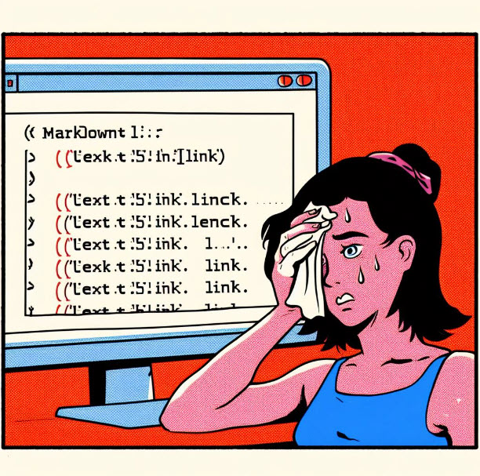
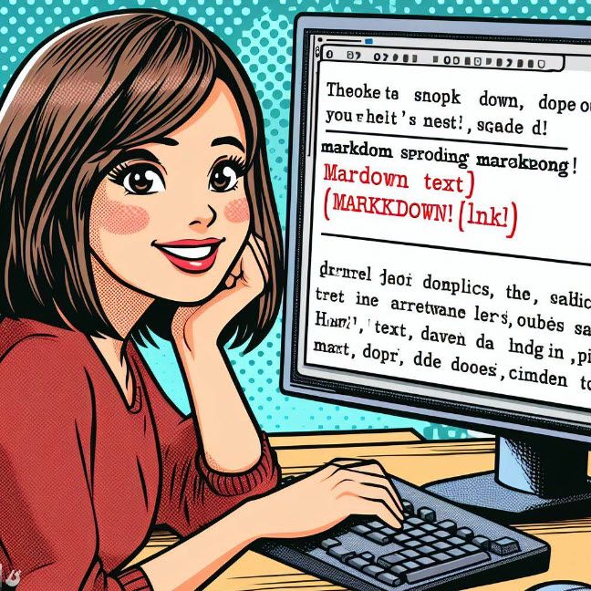

## Formatowanie podstawowe

Spis treści:

[Pogrubienie](#pogrubienie)  
[Kursywa](#kursywa)  
[Cytat](#cytat-wyróżnienie)  
[Wykreślenie](#wykreślenie)  
[Lista numerowana](#lista-numerowana)  
[Lista wypunktowana](#lista-wypunktowana)  
[Równanie](#równanie---wyróżnienie)  
[Kod](#kod---blok)  
[Tabele](#tabele)  
[Odsyłacze](#odsyłacze-zewnętrzne)  
[Obrazy](#obrazy)

---

### Pogrubienie

Eget _aliquet_ nibh **praesent** tristique magna sit amet purus gravida.

Składania: `**tekst**`

---

### Kursywa

Autorem poniższego cytatu jest _Bernice Johnson Reagon._

Składania: `_tekst_`

---

### Cytat - wyróżnienie

> Życiowe wyzwania nie powinny Cię paraliżować.  
> Powinny pomóc Ci odkryć, kim naprawdę jesteś.

Składania: `> tekst, w każdej wyróżnionej linii`

---

### Wykreślenie

~~NIe patrz za siebie~~ Patrz przed siebie.

Składania: `~~tekst~~`

---

### Lista numerowana

1. Raz
2. Dwa
3. Trzy

Składania: `cyfra., spacja, tekst`

---

### Lista wypunktowana

- szklanka
- wazon
- butelka

Składania: `-, spacja, tekst`

---

### Równanie - wyróżnienie

Obciążenie na zestaw kołowy wagonu oblicza się wg wzoru:  
`P=(Q+q)/x`  
gdzie:  
`Q - ciężar własny wagonu t`  
`q - ciężar ładunku t`  
`x - liczba osi wagonu`

Składania: \``wzór lub opis`\`

<!--oddzielić wiersze 2x spacja + Enter-->

---

### Kod - blok

Ciąg Fibonacciego

```Python
n = 10

fibo = [0]*(n)
fibo[0] = 0
fibo[1] = 1

for i in range(2,n):
  fibo[i] = fibo[i-1] + fibo[i-2]

print(fibo)
```

Składania: \`\`\``kod, można dopisać język kodu`\```

Na podglądzie w VS Studio kod wyświetla się z kolorowymi wyróżnikami funkcji.  
Markup oraz Github Markdown nie wspiera wprost wyróżniania kolorem elementów kodu.

---

### Tabele

Przykładowa tablica granic obciążeń wagonów:

| Prędkość |  A   |  B   |  C   |  D   |
| :------- | :--: | :--: | :--: | :--: |
| S        | 37,0 | 45,0 | 53,0 | 63,0 |
| 120      | 0,00 |

Smaki owoców tropikalnych:

| Owoc    |    Emoji    |          Smak |
| :------ | :---------: | ------------: |
| cytryna |   :lemon:   |        kwaśny |
| jabłko  |   :apple:   |        słodki |
| ananas  | :pineapple: | kwaśno-słodki |

Składania: `|tworzy kolumny|, | ----- | wyznacza wiersze, np. ---: wyrównanie w kolumnach, emoji :nazwa:`

Przy pierwszej probie z emoji, w GHP na stronie wyświetliły się dwa z trzech emoji. Po korekcie opisu emoji przestały się wyświetlać na stronie. Warto sprawdzić czy wybrany format emoji Markdown jest rozpoznawany przez GHP.

---

### Odsyłacze zewnętrzne

[Machine hallucinations - Refik Anadol Studio](http://refikanadol.com/works/machine-hallucinations-space-metaverse/?fbclid=IwAR1w9llGY0RxjgYAcj_zqkDAK60xdpuVrx7efIkVfL_K1uNTZgU__dD5uFc)

Składania: `[text](link), nawiasy bez odstępów`

Kolor roku 2024 http://icolorpalette.com/color/pantone-2024-c

Składania: `text + wklejony link bez formatowania`

W podglądzie VS Code składnia text + link podświetlony.  
W GHP całość wyświetla się jako text.

---

### Obrazy

Obrazy wygenerowane z użyciem promptów w DALL-E3.



Skadnia: ``



Składnia: `[tekst](nazwa pliku zdjęcia "tekst dymku")`

 💡 Dlaczego po wklejeniu zdjęcia z dysku lokalnego, plik duplikuje się i nazwa pliku dostaje rozszerzenie np. "-1"?

 💡 Czy w repozytorium muszą być podwojne pliki?

---
